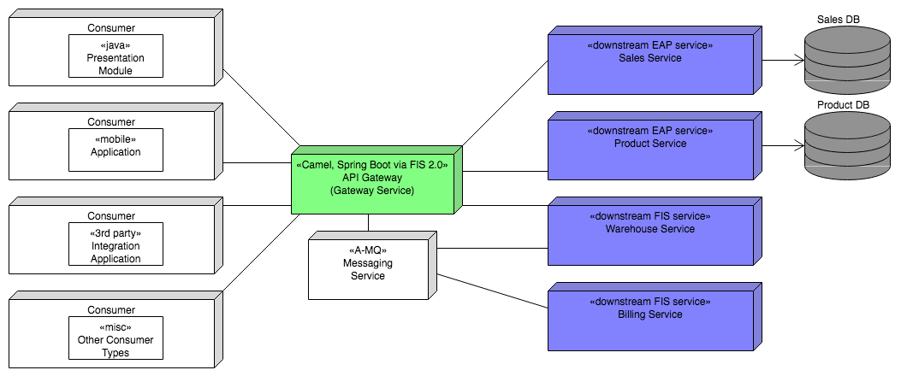

# Fuse Integration Services 2.0 Reference Architecture
This reference architecture continues to build on previous work designing, developing and deploying microservices hosted by JBoss EAP 7 to OpenShift Container Platform. The architecture further 
extends the functionality of the previous project by utilizing the Red Hat JBoss Fuse Integration Services 2.0 xPaaS image to incorporate an API Gateway, thereby presenting a single API to upstream clients while proxying and routing requests to and from a mixture of event-based and API-based downstream microservices. The API Gateway service and event-based portion of microservices utilize the Spring Boot and Camel archetypes available via Fuse Integration Services 2.0, alongside the OpenShift Container Platform Messaging service backed by Red Hat JBoss A-MQ, to showcase orchestration of message-oriented middleware components via a variety of Enterprise Integration Patterns. Lastly, monitoring of the various microservices and event-based coordination is demonstrated on a per-service level, via FIS 2.0's built-in HawtIO integration, and on an all-encompassing aggregrated-container basis, via the EFK (Elasticsearch, Fluentd, and Kibana) Logging Stack.

## Overview
The primary OpenShift project, fis2-msa, includes nine services, collectively representing an eCommerce service scenario:

### A-MQ (Messaging)
\[A-MQ deployment] Elastic messaging broker for gateway and event-driven modules

### Billing Service
\[FIS 2.0 deployment] Event-driven module simulating payment processing and validation

### Gateway Service
\[FIS 2.0 deployment] Microservices gateway API module serving to route and proxy API requests from upstream consumers to downstream services

### Presentation
\[EAP 7 deployment] Representation of a possible upstream consumer; simple eCommerce website

### Product DB
\[MySQL deployment] Product information database

### Product Service
\[EAP 7 deployment] RESTful service providing logic regarding product information

### Sales DB
\[MySQL deployment] Transaction and customer information database

### Sales Service
\[EAP 7 deployment] RESTful service providing logic regarding customer and order information

### Warehouse Service
\[FIS 2.0 deployment] Event-driven module simulating warehouse shipping fulfillment of successful transactions

## Design

## Deployment
For more information on design, deployment, utilization, please see the accompanying [Building Microservices on OpenShift Container Platform with Fuse Integration Services](https://access.redhat.com/documentation/en-us/reference_architectures/2017/html/building_microservices_on_openshift_container_platform_with_fuse_integration_services/) Reference Architecture. 

